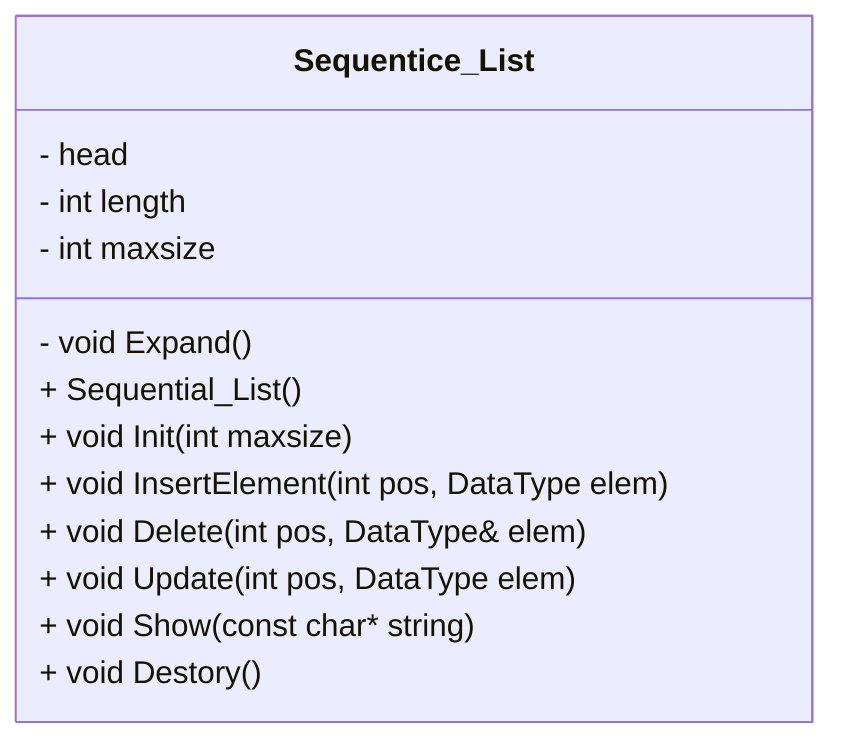

# Executable Data-Structure Code for C/C++
## Introduction
> Hi there! This is Jevon 
> - I'm new to all these thing including 
>  **GitHub ,   Data Struct ,   Coding Language C and C++**  
> * Since it's the second time for me to study Data Struct,
I consider it a good time to code runnable code with C and C++.
The reference book i use is **《Data Dtructure》 written by 严蔚敏**
>
>* I've met huge difficulties when I first studying this book, 
which provide massive pseudocode. I can only try to understand the code 
in book without typing them in IDE to verify them. 
>* Then this project occured to solve that obstacle, 
**You can immediately use some parts or modify little codes to prove your thoughts**.
- tips:
It's a normalized coding style project that might be mied by c++ grammer in C programe 


## Guide
### Using Tool: Visual Studio 2022

Files in Github 
> Non Visual Studio Users can get started by main.cpp and C or C++  

|File/Folder name | describtion|Path|
|:-:|:-:|:-:|
|C| place where store C codes |Data Struct/C |
|C++|place where store C++ codes |Data Struct/C++|
|API| place where store .h files |Annotations help you call functions|
|Definition|place where store C codes |Specific codes how function runs
|main.cpp|**Standard Enterance**|Data Struct/main.cpp|
|Data Struct.sln| **VS Enterance** |


##  `C++ Details`
- [Class Diagram](#class-diagram)
- [Structure Storage](#memory-structure)


## main.cpp
>    you can control wheather C or C++ Data Structure
>    example:
>>    void C_Test()
>>>	{
>>>		//TestSeqList();//完毕  
>>>		TestLinkList();//完毕  
>		//TestSeqStack();//完毕  
>		//TestLinkStack();//完毕  
>		//TestSeqQueue();//完毕  
>		//TestLinkQueue();//完毕  
>		//TestBinaryTree();//完毕  
>	}  
>   - Select the Data structure function by remove "//"

## Attention!
- //完毕 only refers functions are basically tested, it may well be something wrong when modifying them.
- So I reccommend you commit in issues , even commit updates.
- Hope it helps your study :D


#### Basic Knowledege
* baisc print function in **C** is printf while I used std::cout in **C++** instead all the times
>C++
> ```C
> void main()
> {
>     int x;
>     std::cin >> x;//输入
>     std::cout << x << std::endl;//输出
>     return 1
> }
> ```
> also you can use namespace std to remove **std::**
> ```C++
> using namespace std;
> int main()
> {
>     int x;
>     cin >> x;//输入
>     cout << x << endl;//输出
>     return 1
> }
> ```
>> **If you want appoint C as your coding language you should craete .c files rather than .cpp files which Visual Studio always make .cpp file for c++**

#### High quality net
[Runnoob](http://www.runoob.com/) is good enough for who unfamiliar with coding gramma.


# In Progress
- Developing C++ codes by using Object-Oriented
- Memory Digrames for each structure.
- Supplement Thread Tree Preorder and Postorder traversal


# Test Case
## Binary Tree


## Thread Tree
Currently only Inorder Traversal is available.

## Binary Search Tree


# Memory Structure
## Sequentence List


# Class Diagram


# [Top](#executable-data-structure-code-for-cc)


